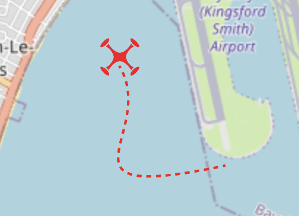

# DroneShield Software Tech Test

DroneShield's mission is to provide the best Counter-drone defence in an emerging industry.

This code challenge involves building a Counter UAS simulator and user interface for the tracking of drones.

1. Overview of the backend
2. Overview of the frontend
3. Tasks

4. Development notes

- VSCode IDE Setup
- Getting the Go backend running
- Getting the Typescript backend running
- Getting the frontend project running

---

### 1. Overview of the backend

The provided backend code simulates two microservices that interface with each through redis publish and subscribe:

- one microservice that publishes to redis the coordinates of the drone, and
- another microservice that subscribes to the publisher and pushes events to a websocket

Note: There are two backend implementations. One is in Go and other is in Typescript. You only need to run **either** the Go or the Typescript, according to your preference.

---

### 2. Overview of the frontend

Currently, the frontend provides:

- a map
- a placeholder icon of a drone on the map
- websocket connection with the received data logged to the console

## 3. Tasks

Please complete as many of the tasks below as you like, but most people attempt two or three tasks. Please try to spend no more than 3 hours in total.

---

### Task 1

(30mins - 60mins)

**The drone icon moves according to updates on the websocket**

{width=300}

In a functioning app, the drone icon should move on the map depending on the location data provided in the websocket message.

Note: unnecessary re-renders should be avoided

---

### Task 2

(30 mins - 60 mins)

**As the drone moves on the map, add a tracking line**

{width=265}

A line should trail the drone marker, indicating the path history of the detection location updates

Tip: Leaflet has a _Polyline_ component suitable for this

---

### Task 3

(30 mins - 45 mins)

**Write some unit tests**

Identify one or two components that could benefit from testing, and write a couple of unit tests.

Note: **vitest** is already included in the package.json `devDependencies`

---

### Task 4

(open ended)

**Identify some bugs, anti-patterns, or architecture improvements, and fix them up**

This is an open ended task, you are free to do as you please.

Note: you might like to consider error handling

---

### Task 5 - Full Stack

(1 - 2 hours)

**Implement some additional simulations**

The backend currently implements a 'random' simulated flying pattern.

The task here is to implement some additional flying patterns such as "Figure 8", "Circle" or "Zigzag".

The flying pattern can be changed via HTTP request or direct command through websocket.

On the frontend, add an appropriate UI widget to change the flight patterns.

## Development notes

This project has been setup for development using VS Code.

If you're unable to use VS Code, you may need to modify (or disable) the linting setup.

---

### Run the sample using the Go backend

From the root of the project:

```
docker compose up --build
```

---

### Run the sample using the Typescript backend

First, you will need a Redis server.

On Mac:

```
brew install redis
brew services start redis
```

(When finished, you can remove redis with `brew remove redis`)

On PC:

See: https://redis.io/docs/latest/operate/oss_and_stack/install/install-redis/install-redis-on-windows/

Once Redis is installed, from the root of the project:

Run the publisher:

```
cd drone_publisher_ts
npm i
npm run dev
```

Run the subscriber:

```
cd drone_subscriber_ts
npm i
npm run dev
```

---

### Frontend

First, make sure that the backend is running.

Then from the root of the project:

```
cd drone_frontend
npm i
npm run dev
```

The UI will be available here: http://localhost:5173

---

### Wrapping up

Please conclude by including some commentary on:

(i) assumptions and decisions that you made whilst approaching these tasks

(ii) ideas for further improvements in your solutions

(iii) what would need to be done to make it production ready including testing.
