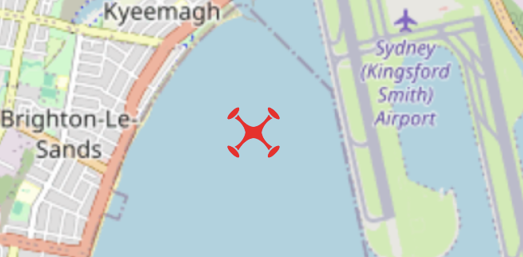
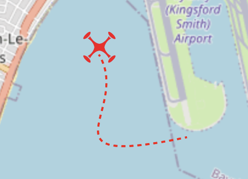

## Please complete as many of the tasks below as you like, but most people attempt two or three tasks. 
## Please try to spend no more than 3 hours in total.

### Task 1

(30mins - 45mins)

**The drone icon moves according to updates on the websocket**

{width=300}

In a functioning app, the drone icon should move on the map depending on the location data provided in the websocket message.

Note: unnecessary re-renders should be avoided

---

### Task 2

(30 mins - 45 mins)

**As the drone moves on the map, add a tracking line**

{width=265}

A line should trail the drone marker, indicating the path history of the detection location updates

Tip: React Leaflet has a _Polyline_ component suitable for this

---

### Task 3

(30 mins - 45 mins)

**Handle when the drone moves outside of the visible map area**

As the drone marker moves around, find a solution for handling when the marker moves outside of the visible map.

Provide an option in the UI to enable/disable this feature.

---

### Task 4

(30 mins - 45 mins)

**Write some unit tests**

Identify one or two components that could benefit from testing, and write a couple of unit tests.

Note: **vitest** is already included in the package.json `devDependencies`

---

### Task 5

(open ended)

**Identify some bugs, anti-patterns, or architecture improvements, and fix them up**

This is an open ended task, you are free to do as you please.

Note: you might like to consider error handling

---

### Task 6 - Full Stack

(1 - 2 hours)

**Implement some additional simulations**

The backend currently implements a 'random' simulated flying pattern.

The task here is to implement some additional flying patterns such as "Figure 8", "Circle" or "Zigzag".

The flying pattern can be changed via HTTP request or direct command through websocket.

On the frontend, add an appropriate UI widget to change the flight patterns.